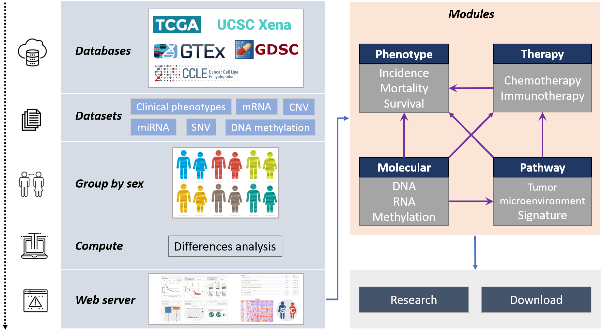

# SDC
Sex Differences in Cancer
http://sdc.yichaozheng.cn

http://sdc.anticancer.xyz

## Raw data
All Raw can be downloaded from follow link and put into *rawdata* folder for subsequent analysis.

### Phenotype

* [TCGA TARGET GTEX selected phenotypes (n=19,131) UCSC Toil RNA-seq Recompute](https://toil-xena-hub.s3.us-east-1.amazonaws.com/download/TcgaTargetGTEX_phenotype.txt.gz)
* [Curated clinical data (n=12,591) Pan-Cancer Atlas Hub](https://tcga-pancan-atlas-hub.s3.us-east-1.amazonaws.com/download/Survival_SupplementalTable_S1_20171025_xena_sp)
* [Molecular subtype (n=7734)](https://tcga-pancan-atlas-hub.s3.us-east-1.amazonaws.com/download/TCGASubtype.20170308.tsv.gz)

### Gene expression RNAseq

* [RSEM expected_count (n=19,109) UCSC Toil RNA-seq Recompute](https://toil-xena-hub.s3.us-east-1.amazonaws.com/download/TcgaTargetGtex_gene_expected_count.gz)

* [RSEM tpm (n=19,131) UCSC Toil RNA-seq Recompute](https://toil-xena-hub.s3.us-east-1.amazonaws.com/download/TcgaTargetGtex_rsem_gene_tpm.gz)

### miRNA gene quantification

* [Illumina HiSeq](https://portal.gdc.cancer.gov/)

### DNA methylation

* [Methylation450k](https://xenabrowser.net/datapages/?host=https%3A%2F%2Ftcga.xenahubs.net&removeHub=https%3A%2F%2Fxena.treehouse.gi.ucsc.edu%3A443)

### Somatic mutation (SNP and INDEL)

* [MC3 public version](https://tcga-pancan-atlas-hub.s3.us-east-1.amazonaws.com/download/mc3.v0.2.8.PUBLIC.xena.gz)

### Copy number

* [copy number (gene-level)](https://tcga-xena-hub.s3.us-east-1.amazonaws.com/download/TCGA.PANCAN.sampleMap%2FGistic2_CopyNumber_Gistic2_all_data_by_genes.gz)

* [copy number segments](https://tcga-xena-hub.s3.us-east-1.amazonaws.com/download/TCGA.PANCAN.sampleMap%2FSNP6_genomicSegment.gz)

### Pathway

* [z score of 1387 constituent PARADIGM pathways](https://tcga-pancan-atlas-hub.s3.us-east-1.amazonaws.com/download/PanCan33_ssGSEA_1387GeneSets_NonZero_sample_level_Z.txt.gz)

### Immunotherapy response

* [Summary of TME subtype for each analyzed tumor (Table S6)](https://ars.els-cdn.com/content/image/1-s2.0-S1535610821002221-mmc6.xlsx)

### Drug sensitivity

* [Genomics of Drug Sensitivity in Cancer](https://www.cancerrxgene.org/downloads/bulk_download) (GDSC)
* [Cancer Cell Line Encyclopedia](https://portals.broadinstitute.org/ccle/data)(CCLE)

## About

***Cite us!***

***Contact:***

Longfei Zhao: Longfei8533@qq.com

Yichao Zheng: yichaozheng@zzu.edu.cn

